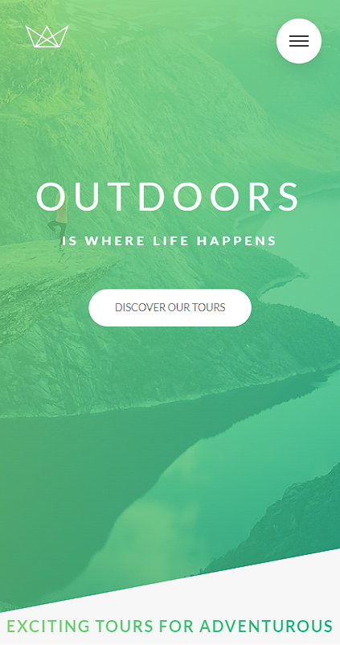

# Natours

## Table of Contents

- [About](#about)
- [Screenshots](#screenshots)
    - [Desktop](#desktop)
    - [Tablet](#tablet)
    - [Phone](#phone)

## About

Natours is a landing page developed during [Advanced CSS and Sass: Flexbox, Grid, Animations and More!](https://www.udemy.com/course/advanced-css-and-sass/) course.

Natours is a website focused on nature tours throughout the world with multiple options of duration, number of guides, lodgings and difficulty.

Designed by: [Jonas Schmedtmann](https://www.udemy.com/user/jonasschmedtmann/).

## Screenshots

### Desktop

### Tablet

### Phone
